# Expense Tracker

A multi-platform **Flutter** application for managing personal **expenses and incomes** — helping you track what you earn and what you spend in daily life.  
This project is built with **Flutter** and uses **Supabase** as the backend for data storage and management.

---

## ✨ Features

- 📌 Add, edit, and delete **income** and **expense** records  
- 📊 Categorize transactions for better insights  
- 📅 Track daily, monthly, and yearly financial history  
- 🌐 Works across Android, iOS, Web, and Desktop (Windows, Linux, macOS)  
- 🔐 Supabase-powered backend for secure data handling  

---

## 🛠️ Prerequisites

Make sure you have the following installed:

- [Flutter SDK](https://flutter.dev/docs/get-started/install) (latest stable version)  
- [Dart](https://dart.dev/get-dart) (comes with Flutter)  
- A [Supabase](https://supabase.com/) account and project  
- Platform-specific tools:  
  - **Android** → Android Studio / SDK  
  - **iOS** → Xcode  
  - **Web** → Chrome or any supported browser  
  - **Desktop** → Required native build dependencies  

---
## expense_tracker
├── android/            # Android native code                                  
├── ios/                # iOS native code                              
├── lib/                # Main Flutter source code                     
│   ├── main.dart       # Entry point of the app                       
│   ├── models/         # Data models (Expense, Income, User, etc.)    
│   ├── screens/        # Screens (Dashboard, Add Expense, Add Income)   
│   ├── services/       # Supabase integration and API handling        
│   ├── utils/          # Helpers, validators, constants               
│   └── widgets/        # Reusable UI components                       
├── test/               # Unit and widget tests                       
├── supabase_schema.sql # Database schema for Supabase                 
├── pubspec.yaml        # Dependencies and assets                     
└── README.md           # Project documentation                       

---

## 📸 Screenshots

  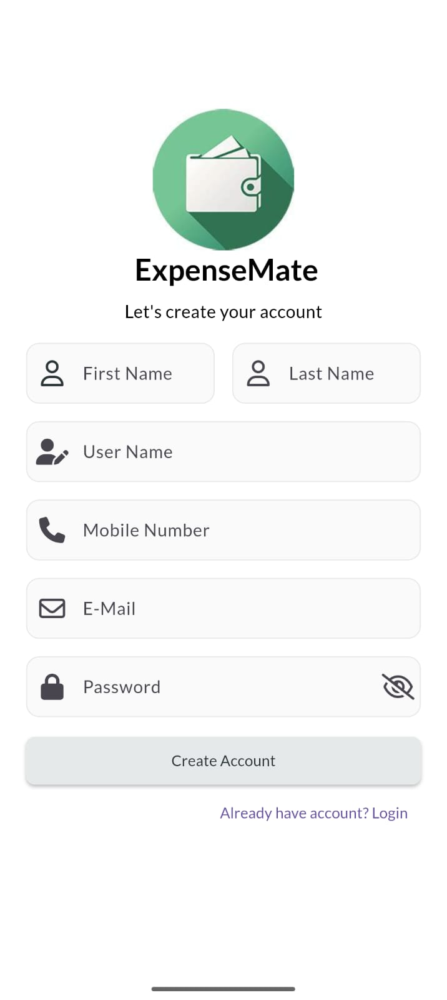&nbsp;&nbsp;&nbsp;&nbsp;
  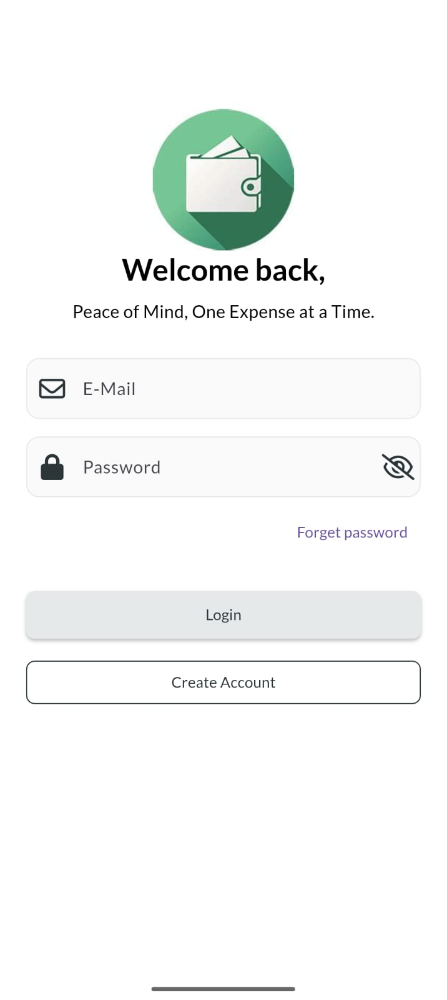&nbsp;&nbsp;&nbsp;&nbsp;
  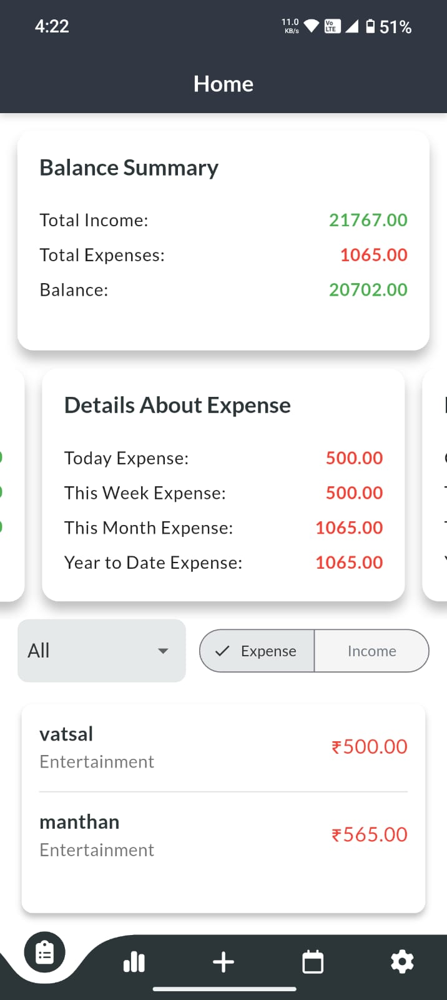&nbsp;&nbsp;&nbsp;&nbsp;
 

&nbsp;

  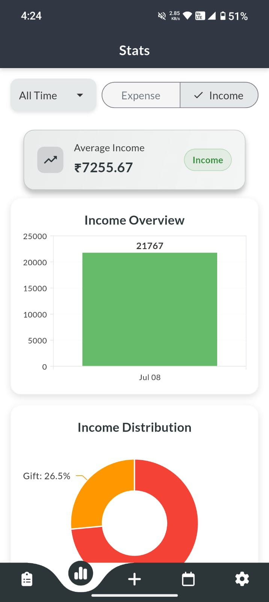&nbsp;&nbsp;&nbsp;&nbsp;
  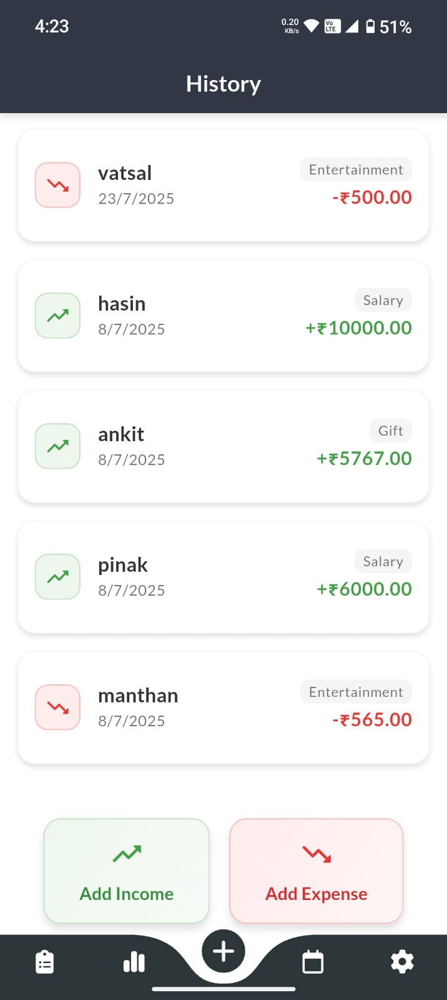&nbsp;&nbsp;&nbsp;&nbsp;
  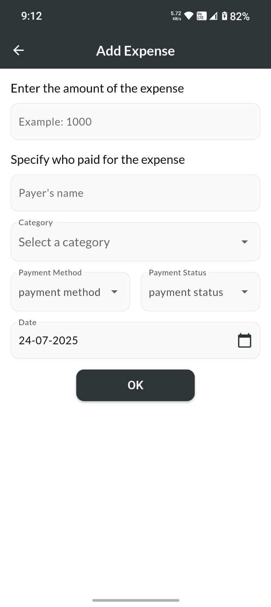

&nbsp;

  
  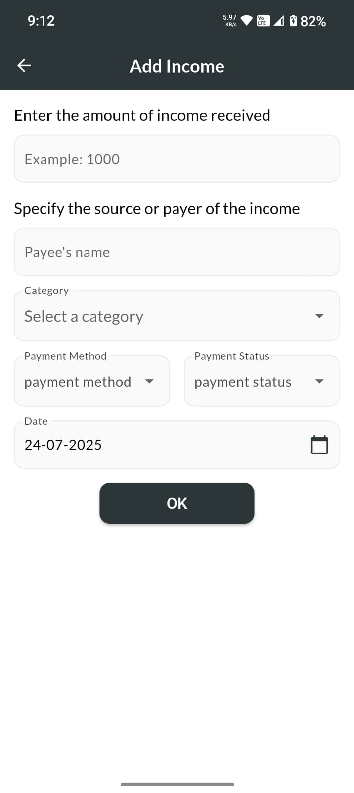&nbsp;&nbsp;&nbsp;&nbsp;
  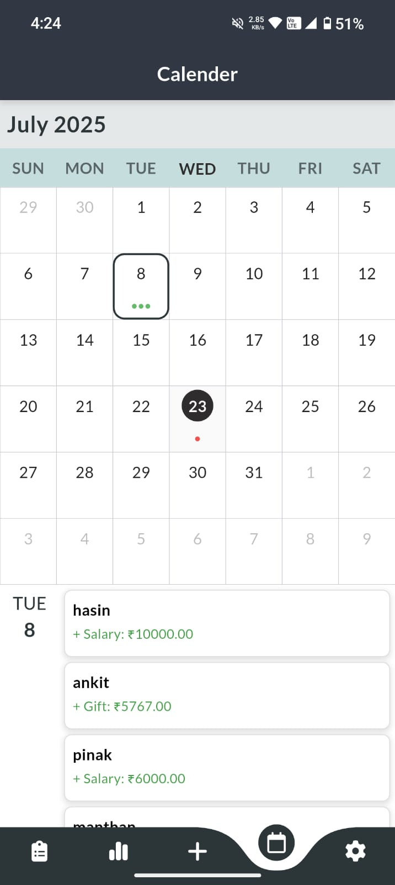&nbsp;&nbsp;&nbsp;&nbsp;
  

&nbsp;

  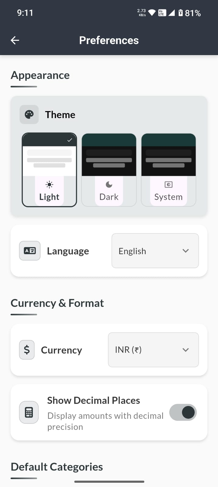&nbsp;&nbsp;&nbsp;&nbsp;
  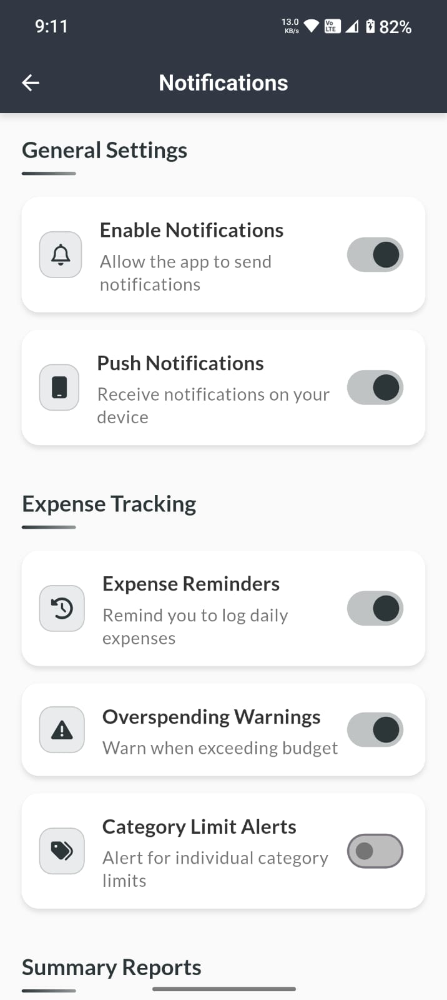&nbsp;&nbsp;&nbsp;&nbsp;
  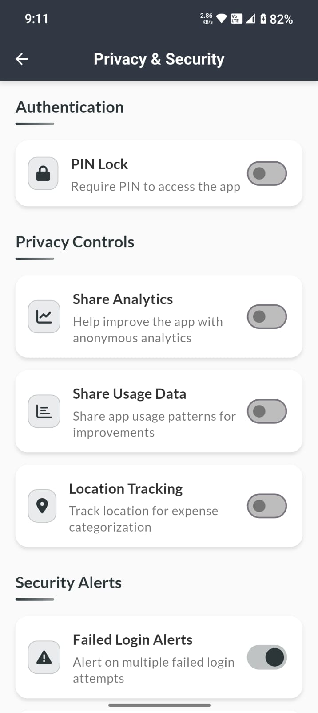

&nbsp;

  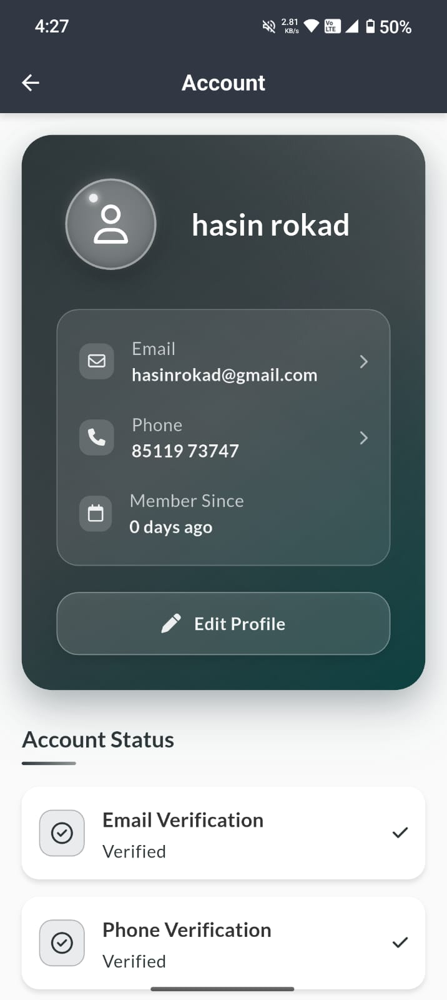&nbsp;&nbsp;&nbsp;&nbsp;
  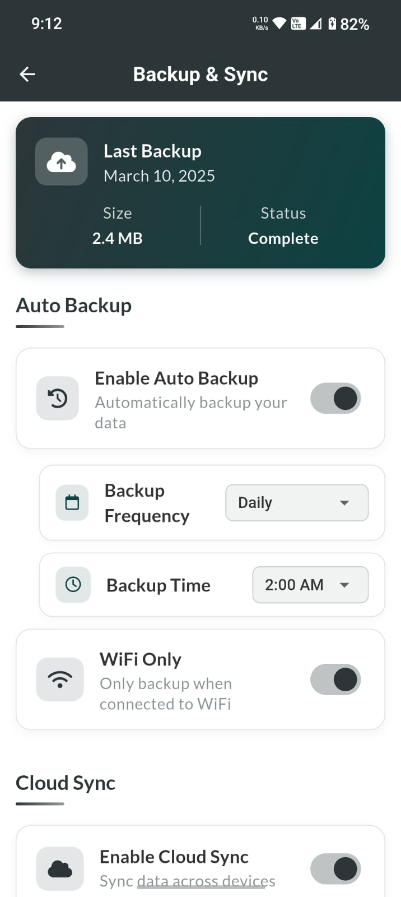&nbsp;&nbsp;&nbsp;&nbsp;
  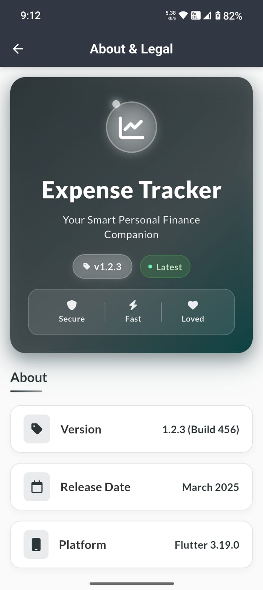

---

## 📌 Tech Stack

This project is built using the following technologies:

- **Frontend:** Flutter, Dart  
- **Backend:** Supabase (Postgres + Auth + Storage)  
- **State Management:** Provider / Riverpod (based on project setup)  
- **Platforms Supported:**  
  - **Android**  
  - **iOS**  
  - **Web**  
  - **Desktop (Windows, Linux, macOS)**  

---

## 📚 Documentation

- [Flutter Documentation](https://flutter.dev/docs)  
- [Dart Language Guide](https://dart.dev/guides)  
- [Supabase Documentation](https://supabase.com/docs)  

---
## 🤝 Contributing

Contributions are welcome!  
1. Fork the repository  
2. Create a new branch (`git checkout -b feature-name`)  
3. Commit your changes (`git commit -m "Add feature"`)  
4. Push to the branch (`git push origin feature-name`)  
5. Open a Pull Request  

## 🚧 Limitations

- No support for recurring transactions or budget limits  
- No offline mode or data caching  
- Limited category management (static list)  

## 🔮 Future Enhancements

- Add user-defined categories and recurring expense tracking  
- Implement budget goals and notifications  
- Enable offline mode with data caching  
- Add dark mode support  
- Export reports in PDF/Excel  

